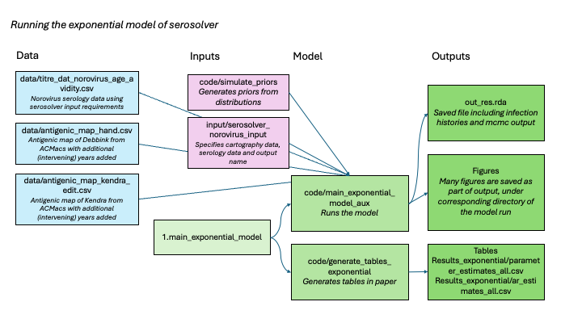

# Overview

This repo provides the code and data for the paper [Estimation of Annual Exposures and Antibody Kinetics Against Norovirus GII.4
Variants from English Serology Data, 2007-2012](https://www.medrxiv.org/). As of the 10-Mar-2026, this manuscript is under review and should appear as a pre-print in medrxiv very soon.

The abstract of the manuscript is below:

Norovirus in humans is highly contagious, causing diarrhoea and vomiting, and is especially common in young children. Winter incidence varies annually, and previous research indicates that the change of dominant norovirus variant is followed by high incidence, but having a clear mechanism to explain this observation could support better prediction of epidemics. Here we analyse unique norovirus serology blockade data from 656 children in England collected via opportunistic sampling between 2007-2012 using a mathematical model of multi-variant antibody kinetics to infer metrics such as annual attack rates and age-specific infection rates. Analysis reveals that overall infection rates were 204 infections per 1000 person-years (posterior median; 95% credible intervals: 188-221). Infection rates were lowest in children aged under 1 year at 164 infections per 1000 person-years (95% CrI: 121-209) and highest in children aged 5 years and older, at 252 infections per 1000 person-years (95% CrI: 212-288). The annual attack rate was highest in 2002, coincident with transition of the dominant variant to Farmington Hills, and high attack rates are frequently observed with emergence of new variants, but not always. Parameter estimates indicate moderate evidence for the immune imprinting hypothesis: a stronger antibody response to variants encountered earliest in life. Estimates of infection rates estimated here from serology are higher than incidence reported within similar settings based on disease only and is consistent with considerable asymptomatic infection. The combined use of multi-variant antibody data and a mathematical model provide key insights on the natural history of norovirus variants which can inform epidemic planning.  

## Instructions for re-using the code

The analysis presented in the paper consists of the following sub-sections, the relevant code description and instruction is taken in turn.

### Description of data   

The norovirus variant serology were first reported in Lindesmith et al [(2023)](https://pubmed.ncbi.nlm.nih.gov/36854303/), and are provided as public data [here](https://zenodo.org/records/7547170).

Plotting the serology by the "age of child at first virus isolation" is available in the script `code/3.generate_infection_trend_results.r` with the handle `p_ic50_seniority`. Within this file there are many exploratory plots.

### Norovirus variant dynamics and antibody cross-reactivity

Antigenic maps are created from mouse sera where they were immunised using a specific variant virus like particles (VLP) and their antigenic response to several variants tested. 

The available data from Debbink and Kendra were run through the online platform [ACMacs](https://acmacs-web.antigenic-cartography.org/)

### Description of mathematical model (serosolver)

For a more detailed description of serosolver, including installation and checking, see [github.com/seroanalytics/serosolver](https://github.com/seroanalytics/serosolver). Before running this code it is strongly recommended that the vignette describing [cross-sectional data](https://seroanalytics.org/serosolver/articles/cs2_vignette.html) is read and run so the general principals are understood.

The model results in the paper focus on using the _exponential_ model, ie. we assume that the short-term response wanes exponentially over time. An overview of the relationships between r code, data, inputs, and outputs are given below. The estimation process is run using the script in `1.main_exponential_model.r` and this runs both the estimation process and the generation of figures and tables. If instead re-running the post-mcmc analysis is needed, then make sure that `rerun_mcmc` is set to `FALSE`.

The same process can be followed for the linear model `2.main_linear_model.r`. Additional scripts are available for estimating infection trend results (`3.generate_infection_trend_results`) and comparing attack rates across models and assumptions from the antigenic cartography (`4.compare_all_attack_rates.r`). 

